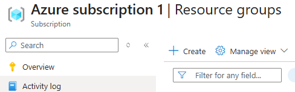
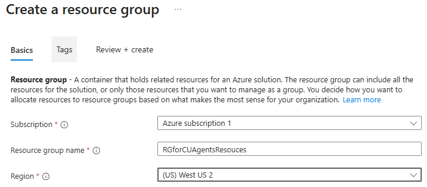
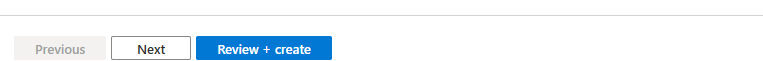
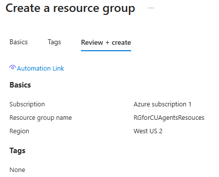

## Task 01: Configure Azure

## Description
You'll verify that your Azure subscription is active and that your account has the Owner or Contributor role, which are both required to support computer-using agents. You'll then create a resource group named RGforCUAgentsResouces in a United States region to contain the Azure-based resources used throughout this lab.

## Success criteria
- You confirmed your Azure subscription status is Active and your role is Owner or Contributor.
- You created a resource group named RGforCUAgentsResouces in a United States region.

---

### 01: Check your Azure subscription properties
You'll need an Azure subscription to bill against. In this task, you'll check the configuration for the billing subscription.

1. Open an InPrivate browser session in **Microsoft Edge** and go to `https://portal.azure.com/`. 

1. Sign in with your tenant administrative credentials.

1. On the **Home** page, select **Subscriptions**.

	

1. Select your subscription from the list.

	

1. On the **Overview** page, confirm that:
 
 	- Status is set to **Active**
 	- Your role is **Owner** or **Contributor**

	

---

### 02: Create a resource group

1. In the navigation pane, select **Resource groups**.

	

1. On the command bar, select **+ Create**.

	

1. In **Resource group name**, enter `RGforCUAgentsResouces`.

1. In **Region**, select a United States region.

1. Select **Review + create**.

	
	

1. Select **Create**.
	
	
	

