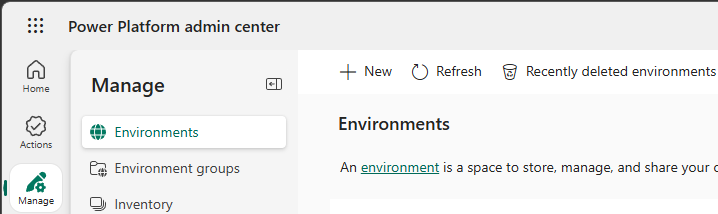
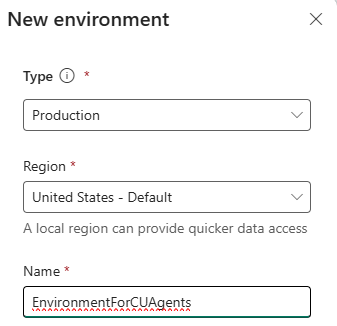
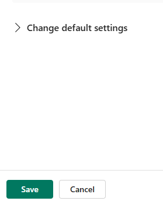
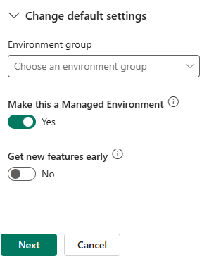
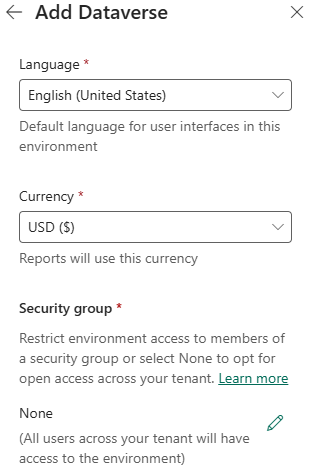
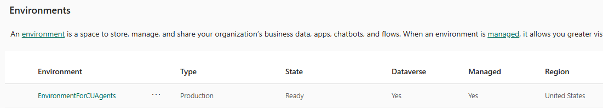
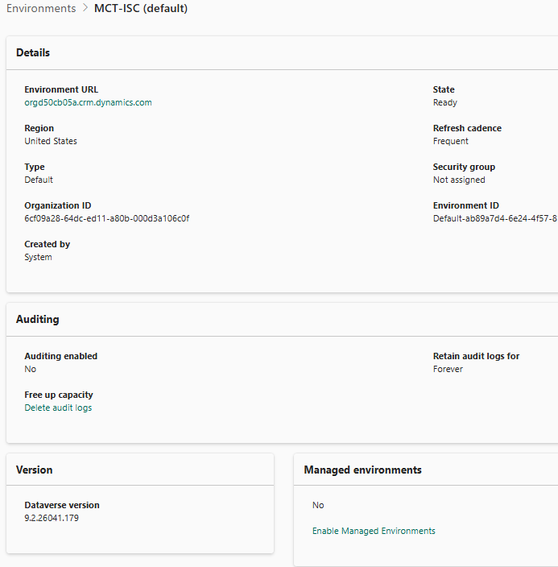
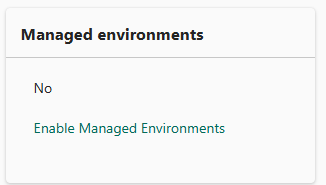
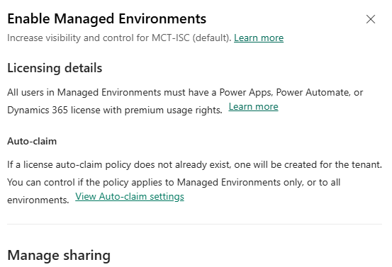
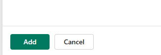

## Task 02: Acquire a Power Platform environment 

## Description
You'll provision or reconfigure a Power Platform environment so it meets the requirements for computer-using agents: a Managed Production type, Dataverse enabled, and hosted in the United States region. Depending on your tenant, you'll either create a new environment named EnvironmentForCUAgents or convert the existing default environment into a managed environment and add Dataverse.

## Success criteria
- You created or reconfigured a Power Platform environment of type Production with Managed - Environments enabled and Dataverse added.
- The environment is hosted in the United States region.
- The environment status shows as Ready on the Environments page.

Computer-using agents must run in a Power Platform environment that meets these requirements:

- Environment type: **Managed Production** with Dataverse enabled
- Hosting region: **United States**

{: .note }
> Some documentation indicates that Sandbox environments may cause provisioning issues. For this lab, use a Production environment.

{: .warning }
> Adding Dataverse consumes tenant storage capacity. If you receive a storage capacity error when adding Dataverse or creating an environment, try configuring the default environment instead.
>
> 

---

### 01: Create a new Power Platform environment 

{: .warning } 
> Complete this section only if you are creating a new environment.
>
> If you plan to use an existing environment, skip to **Section 02: Convert the default environment to a managed environment and add Dataverse.**

1. Open an InPrivate browser session in **Microsoft Edge** and go to `https://admin.powerplatform.microsoft.com/`. 

1. Sign in with your tenant administrative credentials.

1. In the left pane, select **Manage**.

	

1. On the **Environments** page, select **+ New**.

	

1. In the **New environment** pane, configure the fields by using the information in the following table:

	| Field | Value |
	|:---------|:---------|
	| Type   | **Production**   |
	| Region   | **United States**.   |
	| Name   | `EnvironmentForCUAgents`   |	

	
	

1. Go to the **New environment** pane and expand **Change default settings**.

	

1. Set  **Make this a Managed Environment** to **Yes** and select **Next**.

	

1. On the **Add Dataverse** pane, in the **Security group** section, select **+ Select**.

	

1. In **Open access**, select **None**, then select **Done**.

	
	

	{: .warning }
	> This option grants all tenant users access to the environment. For production deployments, configure restricted access.

1. On the **Add Dataverse** pane, select **Save**.

	
	

1. On the **Environments** page, monitor the **State** column. 

	

	{: .note } 
	> Provisioning is complete when the state changes to **Ready**. Select **Refresh** to update the status.
	>
	> 

---

### 02: Convert the default environment to a managed environment and add Dataverse

In many cases, you can use the default environment for your agents. The environment must be hosted in the United States region. You cannot change the region after provisioning.

{: .warning } 
> Perform the steps in this section of Task 02 if you plan to configure an existing Power Platform environment. 
>
> Skip these steps and complete the steps in **Section 01: Create a new Power Platform environment** to create a new environment.

1. Open an InPrivate browser session in **Microsoft Edge** and go to `https://admin.powerplatform.microsoft.com/`. The Power Platform admin center **Home** page displays.

1. Sign in with your tenant administrative credentials.

1. In the left pane, select **Manage**.

	 

1. Locate the environment where the type is **Default**. The default environment depicted in this screenshot is not managed but does include Dataverse.

	

1. Select the environment. The environment details page displays.

	

1. To make this a managed environment, go to the **Managed environments** tile and select **Enable Managed Environments**.
	
	

1. In the **Enable Managed Environment** pane, select **Enable**.

	{: .warning } 
	> Some versions of the interface include an option to add Dataverse during this step. If your environment does not already include Dataverse, select that option before you select **Enable**.

	
	

1. To add Dataverse, on the environment details page, in the **Add Dataverse** tile, select **+ Add Dataverse**.

	

1. In the **Add Dataverse** pane, in the **Security group** section, select **+ Select**.

	

1. In the **Open access** section, select **None**. Then, select **Done**.

	
		

1. Select **Add**. 

	

