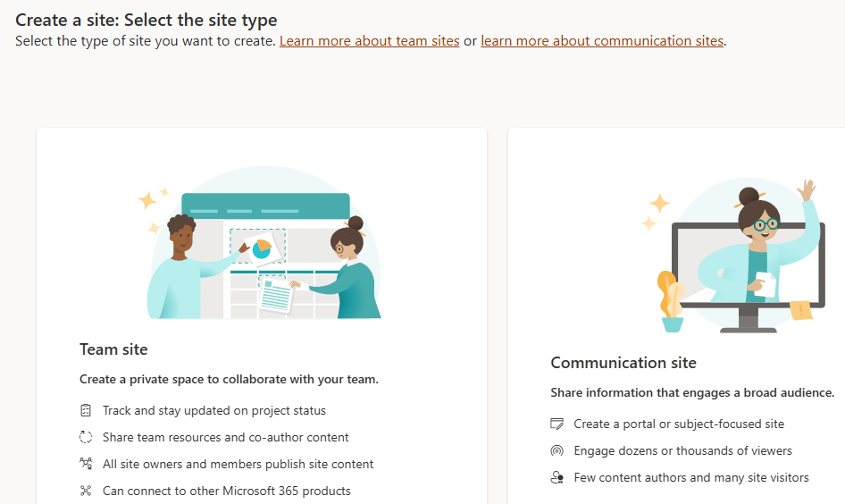
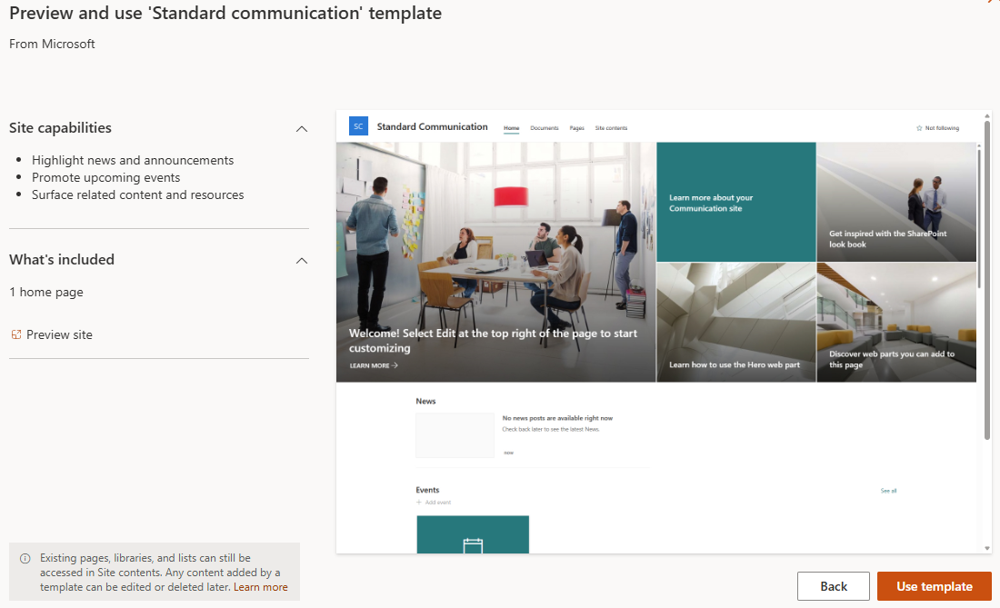
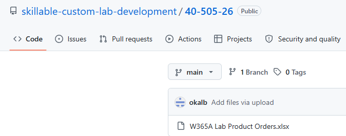
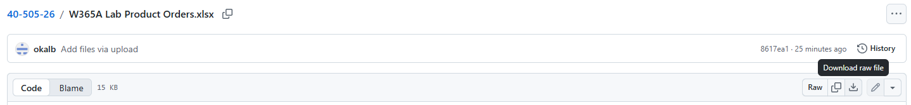
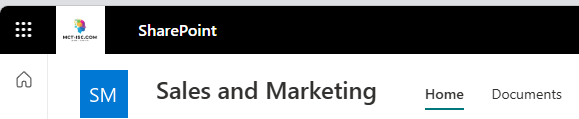
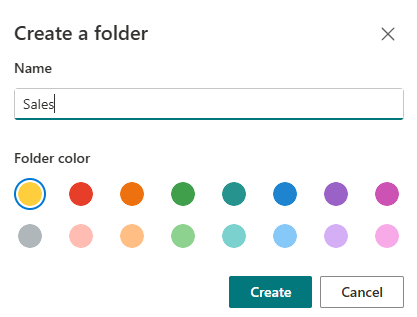
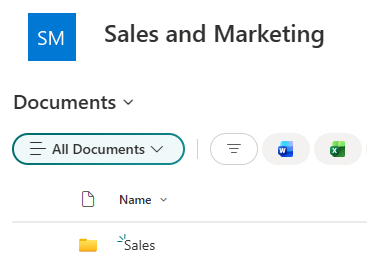
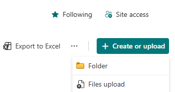
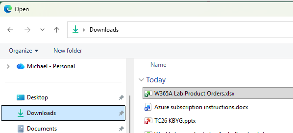
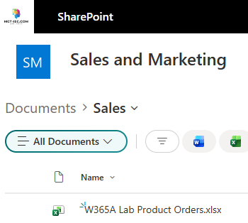

## Task 05: Create a SharePoint site and upload an Excel workbook that represents orders

## Description
You'll create a SharePoint Communication site named Sales and Marketing, download the W365A Lab Product Orders.xlsx workbook from GitHub, and upload it into a Sales folder in the site's document library. The SharePoint site URL you capture here will be used to populate the agent instructions in Exercise 02.

## Success criteria
- You created a SharePoint Communication site named Sales and Marketing and copied its URL into the lab text field.
- You downloaded W365A Lab Product Orders.xlsx from the GitHub repository to your Downloads folder.
- You created a Sales folder in the site's document library and uploaded the Excel file into it.
- You confirmed the file is visible in the SharePoint document library.

---

### 01: Create the site
1. Open an InPrivate browser session in **Microsoft Edge** and go to `https://www.microsoft.com/en-us/microsoft-365/sharepoint`.

1. Sign in by using your administrative credentials.
	
1. On the command bar, select **Create site**.

	

1. In the **Select a template** dialog, select **Communication site**.

	

1. In the **Select a template** dialog, select **Standard communication**.

	

1. Select **Use template**.

	

1. In the **Site name** field, enter the following text and then select **Next**.

	`Sales and Marketing`

	{: .warning } 
	> You may see a message stating that the site name is not unique and cannot be used. If you see this message, try adding numbers to the end of the name until the name is accepted.

	

1. Select **Create site**.

	

1. In the browser address bar, copy the URL for the site. The URL should resemble the following:

	*https://msce09878345.sharepoint.com/sites/SalesandMarketing/*

	

1. Paste the URL into a notepad file for later use.

1. Leave the SharePoint site open. You will return to the site to upload a Microsoft Excel workbook later in this task.

---

### 02: Download the Excel workbook from GitHub
We have placed the Excel workbook in a GitHub repository so that you can easily access the file. In this section, you will download the file so that you can add the file to the SharePoint document library.

1. Open a web browser and go to `https://github.com/skillable-custom-lab-development/40-505-26`.

1. In the list of files, select **W365A Lab Product Orders.xlsx**.

	

1. On the page for the **W365A Lab Product Orders.xlsx** file, on the command bar, select **Download raw file**.

	

1. Confirm that the file has downloaded to your **Downloads** folder.
    
	

---

### 03: Upload the Excel file to SharePoint
In this section, you'll upload the Excel workbook to the SharePoint document library.

3.  On the SharePoint site page, on the command bar, select **Documents**.

	

1. On the command bar for the document library, select **+ Create or upload** and then select **Folder**.

	

1. In the **Create a folder** dialog, in the **Name** field, enter `Sales` and then select **Create**.

	

1. On the document library page, double-click **Sales** to open the folder.

	

1. On the command bar for the document library, select **+ Create or upload** and then select **Files Upload**.

	

1. In the File **Open** dialog, go to the folder where you downloaded the file. Select the  **W365A Lab Product Orders.xlsx** file and then select **Open**.
    
	

1. Check the SharePoint document library to ensure that the file is available.

	

