## Task 01: Create and configure the agent

## Description
You'll create a computer-using agent named Invoice Processing Agent in Copilot Studio using the Create computer-using agent template and the Invoice processing prompt template. You'll then create a cloud PC pool named CUAAgentPool, review the agent's available configuration options (model, inputs, credentials, allowed websites), and set up a connection to the provisioned pool.

## Success criteria
- You created the Invoice Processing Agent in Copilot Studio and confirmed the agent provisioned successfully.
- You created a cloud PC pool named CUAAgentPool and confirmed it reached a fully provisioned state in Power Automate Machine groups.
- You created a connection to CUAAgentPool with maker-provided credentials and saved the tool configuration.

---

### 01: Create the agent
<!--- approx 4 minutes--->
1. Open an InPrivate browser session in **Microsoft Edge** and go to `https://www.copilotstudio.com/`.

1. On the command bar, select **Sign in to Copilot Studio**.

	

1. Sign in by using credentials for a user that has a Copilot license but does NOT have administrative privileges.

1. On the home page, select the **Create computer-using agent** tile. 

	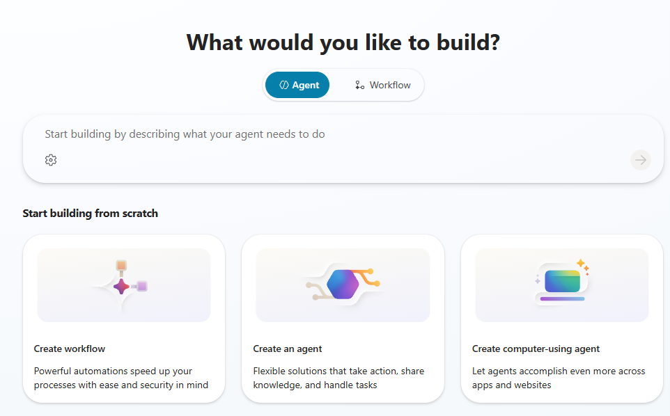

1. In the **Name your agent** dialog, in the **Name** field, enter the following text and then select **Create**.

	`Invoice Processing Agent`

	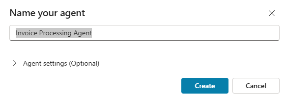

	{: .note } 
	> Your experience may differ from this step. In the previous version of the user interface, Copilot Studio automatically created a name for the agent. You can change the name on the **Overview** page for the agent.

3.  Wait while the agent provisions. 

	{: .warning } 
	> Before the agent provisioning process completes, the system displays the **New computer use** dialog. The agent page displays behind the **New computer use** tool dialog. A banner stating that **This feature isn't available until your agent has finished setting up** displays.
	>
	> 
	>
	> Do not proceed to the next step until the banner message changes to **Your agent has been provisioned**. The provisioning process generally completes within 1-2 minutes.
	>
	> 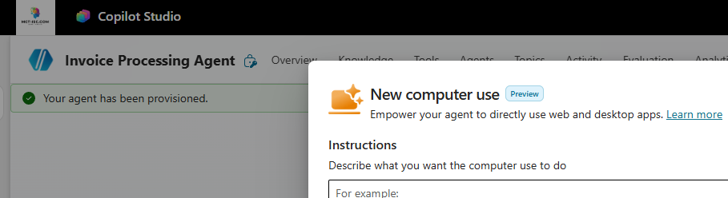

1. After you confirm that the agent is provisioned, in the **New computer use** dialog, select the tile for the **Invoice processing** prompt template.

	

	{: .important } 
	> When you select a template, the text in the **Instructions** pane is updated for you. Copilot Studio will build an agent that interacts with the website specified in the instructions. 
    >
    > The website is publicly available and resembles an invoice management app that your customers may use in their organizations. The following screenshot shows some sample data from the website:
    >
    > 

1. On the **New computer use** dialog, select **Add and configure**. Wait while Copilot Studio provisions the agent. This process typically takes less than two minutes.

	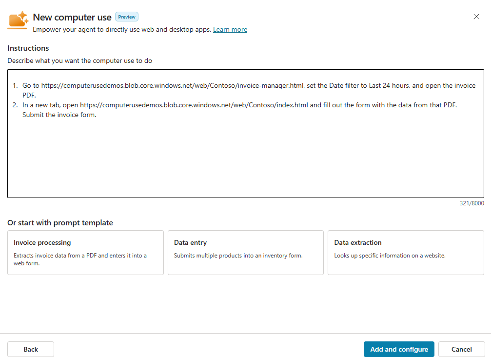

---

### 02: Create a cloud PC pool for the agent

{: .warning }
> The process for creating a cloud PC pool is easy, but there are a lot of things that must go right for provisioning to succeed. Currently, there is no easy way to identify what is happening during provisioning and what may be going wrong.
>
> If the cloud PC pool still shows as **Provisioning** after 45 minutes, refresh your browser and then check to see if the provisioning completed.

<!--- approx 30 minutes including provisioning time--->

1. Move to the **Machines** section. This is where you specify where the agent will run.

1. In the **Machines** section, select **? Help me decide**. 

	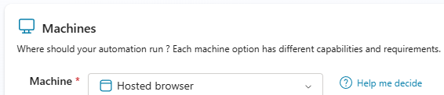

1. In the **Understand where to run your computer use** dialog, review the available options and then select **Close**.

	
1. In the **Machine** field, select **Cloud PC pool** and then select **+ Add new**.

	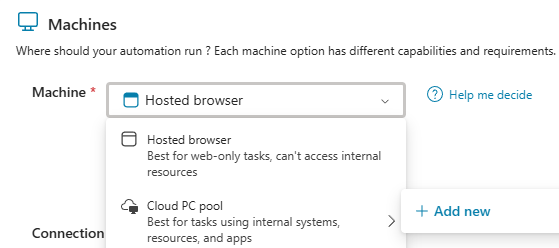

1. On the **Create a Cloud PC pool** dialog, in the **Name** field, enter `CUAAgentPool` and then select **Create**.

    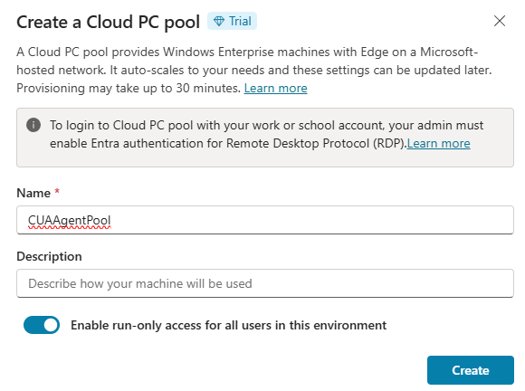

1. Move on to **Part 03: Review other agent options** while you wait for the cloud PC pool to provision.

	
	{: .warning } 
	> It can take 20-30 minutes to provision the PC pool. The Windows Busy indicator (Wait cursor) displays next to the machine group name until the machine group is fully provisioned. The page will also display a page to let you know that the machine pool is provisioning.
	>
	> The Busy indicator and the message may not be visible if you refresh the page. If you select **Manage machines** and then select your machine pool (which is called a machine group in Power Automate), you can find out whether the pool is still provisioning.
	> 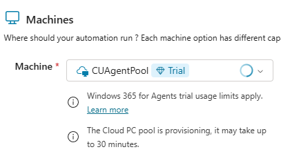

---

### 03: Review other agent options

While the machine pool provisions, let's look at some of the other options that you can configure.

1. Move to the **Details** section for the agent. The **Claude Sonnet** model is selected. This model works well for this. 

	

	{: .note }
	> For customer work, feel free to try other models and see which works best for your specific needs.
	>
	> The models that are available to you may change over time. 

1. Go to the **Inputs** section. This is where you would specify any extra information that the agent needs to perform its duties (over and above what is already listed in the instructions).

	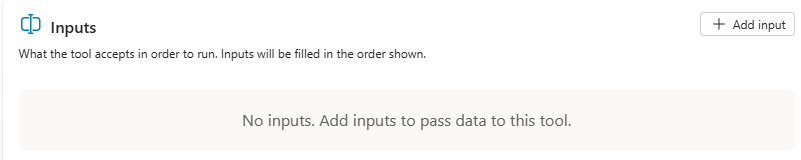

1. Move to the **Credentials** section for the agent. Here, you can decide how to store the credentials that may be required to connect to a resource (for example, an app or a website). You can store credentials within the tool itself or in Azure Key Vault.

	

1. Move to the **Allowed websites and desktop apps** section for the agent. In this section, you can restrict access to specific resources by explicitly listing those resources.

	

	{: .warning }
	> Enabling access control prevents the model from taking actions on websites or apps that you have not explicitly allowed. 

1. Move to the **Machines** section. 

1. In the **Machines** section, select **Manage machines**. Microsoft Power Automate **Machines** page opens in another tab in the web browser.

	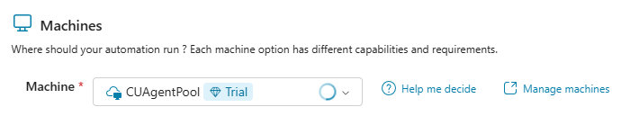

1. On the **Power Automate** page, on the command bar, select **Machine groups**.

	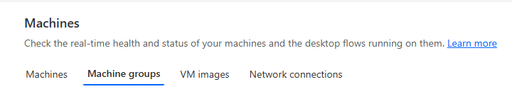

1. In the list of machine groups, select **CUAgentPool**.

	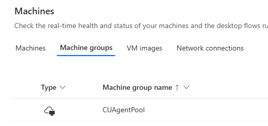

1. Review the details for the machine group.

	{: .warning }
	> You will not be able to see details for the machine group until it is fully provisioned. Do not proceed to **Part 04: Create a connection** until the cloud PC pool is provisioned.

---

### 04: Create a connection
Once the machine pool is provisioned, you can create a connection to the pool. 

{: .warning } 
> Do not complete the following steps unless the machine pool is already provisioned.

1. Return to the web page that displays the **Invoice Processing** tool for the agent.

	

3.  Go to the **Machines** section and then select **+ Create new connection**.

1. In the **Connect to Computer use** dialog, in the **Machine** field, select **CUAgentPool**.

	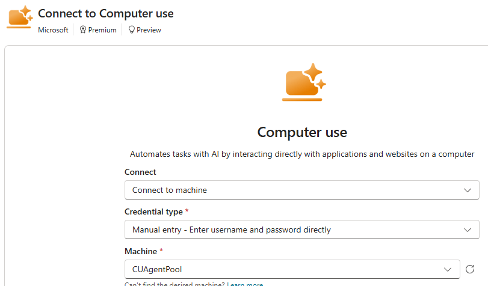

1. Enter credentials for a user that has a Copilot license but does NOT have administrative privileges. Then, select **Create**.

	

1. In the **Credentials to use** field, ensure that **Maker-provided credentials** is selected. 

	{: .note } 
	> There is an option to use agent-provided credentials in development.

	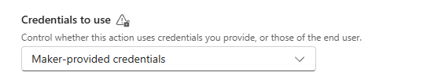

3.  Select **Save**.

1. Remain on the **Invoice processing** tool page.

