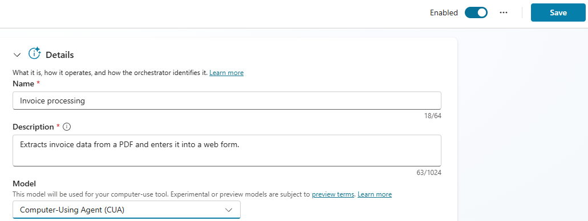

## Task 02: Test the agent

## Description
You'll test the Invoice Processing Agent twice — first using the default Claude Sonnet model, then after switching to the OpenAI Computer-Using Agent (CUA) model — and compare the verbosity and style of output in the Activity pane for each run.

## Success criteria
- You ran a test with the Claude Sonnet model and monitored the Activity pane to confirm the agent opened the Orders site, entered an order, and updated the Excel workbook.
- You selected Finish Testing to complete the test session.
- You switched the tool model to Computer-Using Agent (CUA), saved, repeated the test, and observed the difference in activity output compared to Claude Sonnet.

---

### 01: Test the agent by using the Claude Sonnet model
When you created the agent, you configured the computer-use tool to use the Claude Sonnet model. In this section, you will test the agent as configure.

1. On the **Invoice processing** tool page, go to the **Instructions** section and then select **Test**.

	

1. Wait while the system prepares to test the process.

	

	{: .important } 
	> In the **Testing: Invoice processing** dialog, the **Instructions** and **Activity** panes display on the left. The test machine user interface appears on the right. 
	>
	At the upper right of the dialog, select the double-sided arrow to maximize the screen. This will make it easier to view the operations in the test machine user interface.
	> 

1. Monitor the **Activity** pane and test machine user interface to follow the process. The process ends when the invoice is submitted successfully. The Claude Sonnet model produces verbose output. It tells you what it is thinking, what it plans to do, and provides detailed output for each action.

	{: .warning }
	> During lab development, the entire testing process (from the request for a computer to successful submission of the invoice took between 3-6 minutes.)

	

1. At the upper right of the  **Testing: Invoice processing** dialog, select **Finish Testing**.

	

---

### 02: Test the agent by using an OpenAI model

In this section, you will reconfigure the tool to use an OpenAI model and then test the agent again. This allows you to compare and contrast behavior and performance.

1. On the **Invoice processing** tool page, go to the **Details** section.

	

1. In the **Model** field, select **Computer-Using Agent (CUA)**.

	

1. On the command bar, select **Save**.

	

1. Repeat the steps in Section one of this task to test the agent.

1. Review the text in the **Activity** pane. In contrast to the Claude Sonnet model, the OpenAI model produces less output. You will typically see summary statements but not a lot of details. It takes about the same amount of time for testing to complete by using either model.

	{: .note }
	> Please refer to the instructions in **Section 01: Test the agent by using the Claude Sonnet model** for information on finding the **Activity** pane.

	

