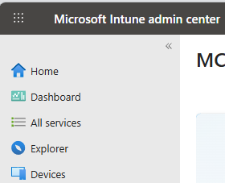
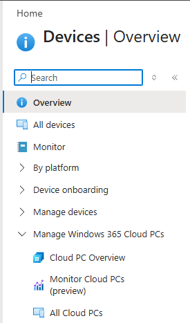
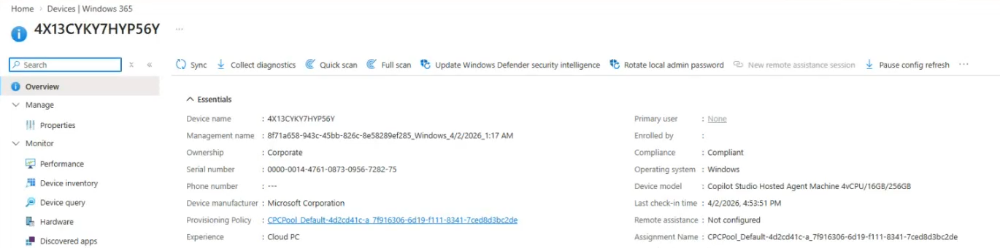

## Task 03: Explore the machine pool by using Microsoft Intune

## Description
You'll navigate to Microsoft Intune to view the cloud PC pool created by the agent tool, inspecting its properties through the All Cloud PCs view under Manage Windows 365 Cloud PCs.

## Success criteria
- You located the cloud PC pool in Microsoft Intune under Devices - Manage Windows 365 Cloud PCs > All Cloud PCs.
- You selected a pool and reviewed its properties.

{: .warning } 
> The user experience for viewing cloud PC pools in Intune is changing. These instructions reflect the recent experience. If you do not see the pools, try following the alternate path:
>
> Home > Devices / Windows > Windows / Windows 365 > Devices

1. Open an InPrivate browser session in **Microsoft Edge** and go to `https://intune.microsoft.com/`.

1. If prompted, sign in by using your administrative credentials.

1. In the left pane, select **Devices**.

	

1. In the **Devices** pane, expand **Manage Windows 365 Cloud PCs** and then select **All Cloud PCs**.

	

1. In the list of machine pools, select a pool.

	

1. View the properties for the selected pool.

	{: .warning } 
	> At this time, you can view the pools and information about each pool, but you cannot make changes. Soon, administrators will have more capabilities.

	

