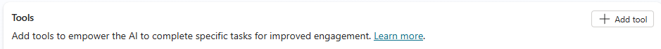
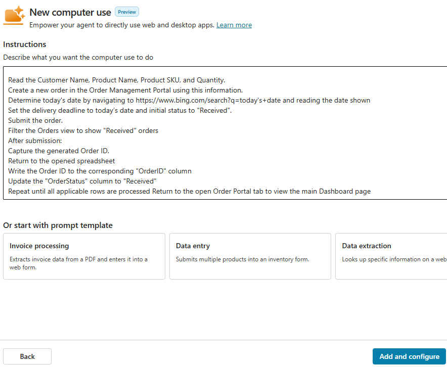
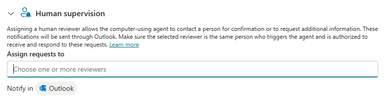
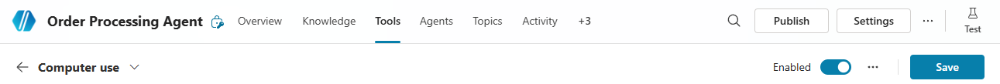

## Task 01: Create and configure an agent

## Description
You'll create a blank agent named Order Processing Agent in Copilot Studio, add a description, and configure a Computer Use tool with custom multi-step instructions that direct the agent to read unprocessed orders from the W365A Lab Product Orders.xlsx spreadsheet on SharePoint and submit each order to the Order Management Portal. You'll then connect the tool to the cloud PC pool from Exercise 01 and configure a human supervision email address.

## Success criteria
- You created the Order Processing Agent and saved the description Use a computer to navigate a website and process orders.
- You added a Computer Use tool with the provided order-processing instructions referencing the SharePoint site URL.
- You configured the tool to use the same cloud PC pool as Exercise 01 and verified an active connection.
- You selected a human supervision email address and saved the tool.

---

#### 01: Create and publish a computer-using agent

1. Open an InPrivate browser session in **Microsoft Edge** and go to `https://www.copilotstudio.com/`.

1. On the command bar, select **Sign in to Copilot Studio**.

	

1. Sign in by using credentials for a user that has a Copilot license but does NOT have administrative privileges.

1. In the left pane, select **Agents**.

	


3.  On the **Agents** page, on the command bar, select **+ Create blank agent**.

	


1. In the **Name your agent** dialog, in the **Name** field, enter the following text and then select **Create**

	`Order Processing Agent`

	

	{: .note }
	> Your experience may differ from this step. In the previous version of the user interface, Copilot Studio automatically created a name for the agent. You can change the name on the **Overview** page for the agent.

1. Once the agent is provisioned, on the **Details** tile, select **Edit**.

	


1. In the **Description** field, enter `Use a computer to navigate a website and process orders`.

1. At the upper right of the **Details** tile, select **Save**.

	

1. Move down the page to the **Tools** section and then select **+ Add tool**.

	

1. In the **Add tool** dialog, select **Add new Computer Use**.

	

1. In the **New computer use** dialog, in the **Instructions** field, enter the following text:

	```
	Dismiss any popups or interruptions encountered during this task.
	To complete this task, open the Order Management Portal in a browser tab: https://automatemywebsite.blob.core.windows.net/web/OrderPortal/index.html
	Open the Sales and Marketing SharePoint site in a separate tab: @lab.Variable(SPSiteURL)
	On the SharePoint site and locate the "W365 Lab Product Orders" Excel file in the Sales folder. Each unprocessed row represents a new customer order.

	For each row where OrderStatus is "New":

	Read the Customer Name, Product Name, Product SKU, and Quantity. 
	Create a new order in the Order Management Portal using this information.
	Determine today's date by navigating to https://www.bing.com/search?q=today's+date and reading the date shown
	Set the delivery deadline to today's date and initial status to "Received".
	Submit the order.
	Filter the Orders view to show "Received" orders
	After submission:
	Capture the generated Order ID.
	Return to the opened spreadsheet
	Write the Order ID to the corresponding "OrderID" column
	Update the "OrderStatus" column to "Received"
	Repeat until all applicable rows are processed Return to the open Order Portal tab to view the main Dashboard page.
	```


1. Review the instructions to ensure that you understand the process that the agent will use. 


3.  Then, select **Add and configure**.

	

1. On the **Order Processing Agent** tool page, go to the **Machines** section.

	

1. Configure the tool to use the same machine pool that you used for Exercise 01.

1. In the **Connection** field, ensure that there is an active connection. Reconnect if necessary, and then select **Save**.

1. On the **Order Processing Agent** tool page, go to the **Human supervision** section.

	

1. Select an account where the system should send email messages when additional information or confirmation is needed.

1. On the command bar, select **Save**.

	
