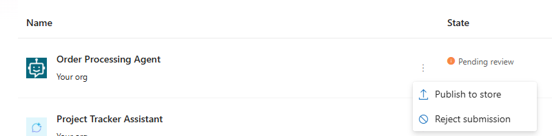
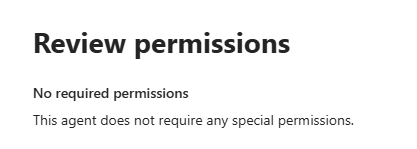
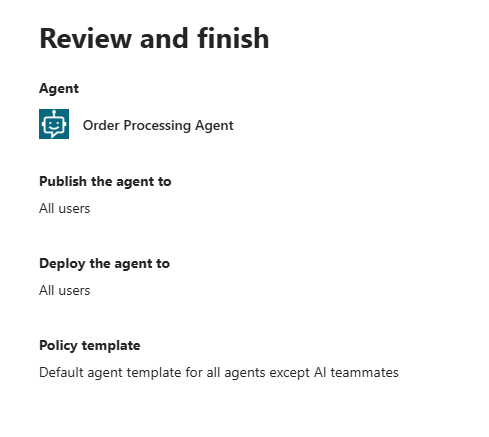

## Task 01: Approve the agent distribution request

## Description
You'll act as a Microsoft 365 administrator to locate the Order Processing Agent in the Microsoft 365 admin center and publish it to all users, stepping through the Apply template, Review permissions, and Review and finish panes before confirming the agent shows as Available in the registry.

## Success criteria
- You located Order Processing Agent in the Microsoft 365 admin center under Agents - All agents.
- You published the agent to all users and confirmed the process completed without errors.
- You selected Registry and confirmed the agent status is Available.

---

#### 01: 

1. Open a browser tab and go to `https://admin.cloud.microsoft/?source=applauncher#/homepage`. This opens the Microsoft 365 admin center.

1. Sign in with your administrative credentials.

1. In the left pane, select **Agents** and then select **All agents**.

	

1. In the list of agents, locate and select **Order Processing Agent**.

	

1. Next to the agent name, select the vertical ellipses (**...**) and then select **Publish to store**.
	
	{: .warning } 
	> Your agent may already show as **Available**. If so, you can skip this step and go back to Copilot Studio to publish the agent. 

	

1. In the **Publish agent to selected users** pane, in the **Select users or groups who can install the agent**, select **All users**.

1. In the **Publish agent to selected users** pane, in the **Select users or groups who will have the agent pre-installed (optional)** field, select **All users** and then select **Next**.

	

1. In the **Apply template** pane, select **Next**.

	{: .note }
	> In a customer or production environment, you should configure policies to protect people, systems, and data.

	
	

1. In the **Review permissions** pane, select **Next**.

	
	

1. In the **Review and finish** pane, select **Publish**.

	
	

1. Wait for the publishing process to be completed and then select **Done**.

	
	

1. On the **All agents** page, on the command bar, select **Registry**. Confirm that **Order Processing Agent** shows as **Available**.

	

	{: .note } 
	> After you complete this process, the agent will not be immediately available. The agent is deployed as a batch process.

