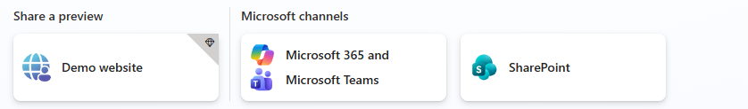
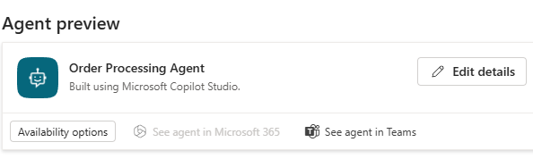
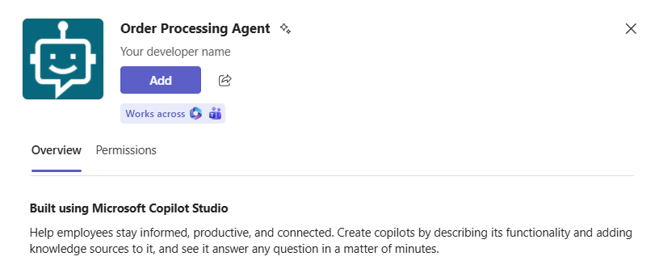
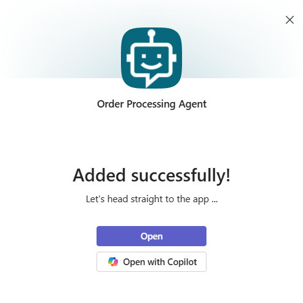
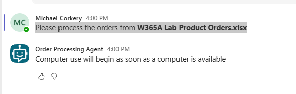

## Task 02: Try out the agent as an end user

## Description
You'll sign in to Copilot Studio as an end user, navigate to the Microsoft 365 and Microsoft Teams channel, open the agent in the Teams web app, add it from the Built for your org store, and submit the order-processing prompt to verify the agent runs successfully for a non-admin user.

## Success criteria
- You signed in to Copilot Studio with end-user credentials and opened the agent in the Teams web app via See agent in Teams.
- You found Order Processing Agent in Apps > Built for your org and added it to Teams.
- You submitted the provided order-processing prompt and confirmed the agent began processing orders.

---

#### 01: Try out the agent as an end user

1. Open an InPrivate browser session in **Microsoft Edge** and go to `https://copilotstudio.microsoft.com/`.

1. On the command bar, select **Sign in to Copilot Studio**.

	

1. Sign in by using credentials for an end user.

1. On the command bar, select **Channels**.

	

1. In the list of tiles that display, select **Microsoft 365 and Microsoft Teams**.

	

1. In the **Microsoft 365 and Microsoft Teams** pane, in the **Agent preview** section, select **See agent in Teams**.

	

1. Wait for the Teams web app to open.

1. In the left pane, select **Apps**.

	

1. In the **Apps** pane, in the **Apps** section, select **Built for your org**.

	{: .warning } 
	> After an administrator approves the request to make the agent available for an organization, it can take some time for the agent to display. If you do not see the agent, wait 10-15 minutes and try again.

	

1. On the **Built for your org** page, in the **Order Processing Agent** tile, select **Add**.

	

1. In the confirmation dialog, select **Add**.	

	

1. In the **Order Processing Agent** dialog, select **Open**.

	

1. Submit the following prompt:  

	```
	Please process the orders from W365A Lab Product Orders.xlsx. Please provide updates about the process and let me know if there are any issues.
	```

	

1. Wait while the agent processes the orders.

	{: .warning }
	> Remember that the agent runs in the context of the identity that created the agent. If prompted to authenticate with MFA, you must use that identity to authenticate.

1. If there is a failure, retest the agent.

---

### Congratulations!
You've completed this lab. You've gone from raw tenant configuration to a fully published, org-wide computer-using agent, setting up the Azure subscription, Power Platform environment, billing plan, and authoring permissions that underpin it all, then building and testing two agents in Copilot Studio: a template-based invoice processing agent and a custom order processing agent that reads from SharePoint and writes back to Excel. Along the way you've seen how cloud PC pools, model selection, human supervision, and channel publishing all fit together.
